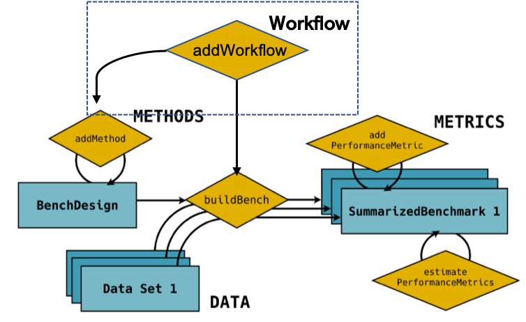

# SummarizedBenchmark_Workflow
### ***SummarizedBenchmark_Workflow*** is an R-based platform for automated benchmarking combinatorial pipelines.

## Introduction
The benchmark of combinatorial analysis pipelines is powerful for studying the impact of each decision-making point in the analysis, but usually creates a large number of pipelines which quickly become untrackable when the number of steps or number of methods in each step increases.
There have been efforts in creating benchmarking platforms to manage datasets and algorithms while they are all designed for benchmarking methods at single analysis step. To accommodate this idea of evaluating combinatorial analysis pipeline and tackle the challenges, we developed a R-based workflow benchmarking platform: SummarizedBenchmark-Workflow (Figure. 1). We extend the framework of SummarizedBenchmark (Kimes., et al., 2019) to enable users to setup an analysis workflow consisting of multiple analysis steps, for example, data normalization, gene selection, clustering, and parameter selection in this study. Each individual step can be a container of multiple methods to be benchmarked, for example, we have three methods for gene selection and 15 methods for clustering. Analysis pipelines can be automatically constructed by iterating through all combinations of methods from each step and benchmarked using the same dataset simultaneously. The platform also records the peak memory occupancy during the analysis and the time cost, which are also essential points in benchmarking especially for large datasets as in current single cell analysis. This platform enabled us to evaluate a large number of pipelines more efficiently. It can be used by algorithm developers to incorporate their new methods into the framework quickly. The platform generalizable to benchmarking studies in other fields. 

